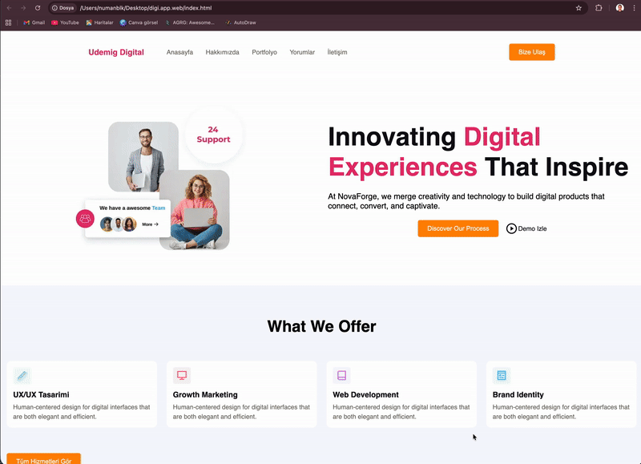

# digi.app.web

Modern ve responsive bir web arayüz projesi.

Bu proje HTML, CSS ve SCSS kullanılarak geliştirilmiştir.  
Amaç; düzenli klasör yapısı, temiz kod organizasyonu ve sürdürülebilir stil mimarisi oluşturmaktır.

--- 
Projede destek ve eğitimlerinde verdikleri emek icin https://github.com/isveckrali ve   eğitim platformuna teşekkür ediyorum.
## 📌 Project Overview

digi.app.web, frontend geliştirme pratiği kapsamında oluşturulmuş bir arayüz çalışmasıdır.

Projede odaklanılan konular:

- Semantik HTML yapısı
- Modüler ve düzenli stil organizasyonu
- SCSS kullanımı
- Responsive tasarım yaklaşımı
- Temiz proje klasör yapısı

Bu çalışma, görsel düzen ile kod disiplini arasında dengeli bir yapı kurmayı hedeflemektedir.

---
---

## 🎥 Demo

Kısa demo GIF:

---

## 🛠 Technologies Used

- HTML5
- CSS3
- SCSS
- Git & GitHub

---

## 📂 Project Structure
---

## 🎯 Purpose

Bu proje ile:

- SCSS kullanım pratiği geliştirildi
- Stil dosyaları organize edildi
- Responsive tasarım uygulandı
- GitHub üzerinde düzenli proje sunumu hedeflendi

---
## 🖥 Fullscreen Screenshot

Sayfanın tam görünümü:

---

## 👤 Author

Numan Balık  

GitHub: https://github.com/numanbalik-web  
LinkedIn: https://www.linkedin.com/in/numan-balik-sverige  
Email: numanbalik72@gmail.com  

---

If you find this project useful, consider giving it a star.
